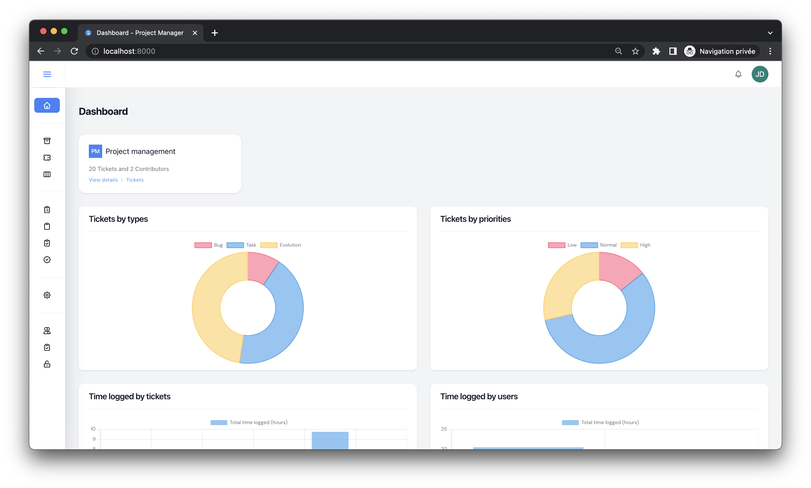

# Introduction

Helper, is a great tool if you want to manage your projects, tickets and be here for your clients
It comes also with more than 60 languages ready to use.
All this made with the best technologies.

## Prerequisites

- PHP 8+
- MySQL 8+

## Screenshots

    </img> 
    </img> 
    </img> 
    </img> 
    </img> 
    </img> 
    </img> 
    </img> 
    </img> 
    </img> 
    </img> 
    </img> 
    </img> 
    </img> 
    </img> 
    </img> 
    </img> 
    </img> 
    </img> 
    </img> 
    </img> 
    </img> 
    </img> 
    </img> 
    </img> 
    </img> 

